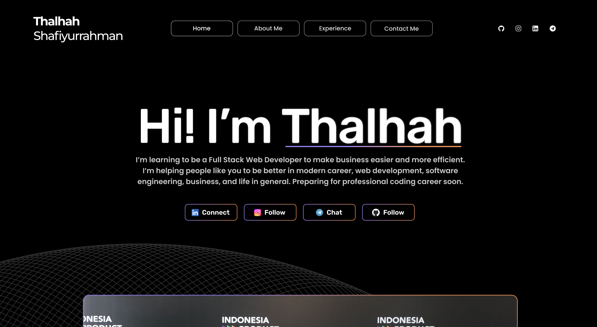

# Thalhah's Personal Website 🌐

This is the repository for my personal website **thalhahs.com**,  
where I share my journey in **technology, education, and business**.

## 🔎 Preview

## 🚀 About Me

Hi, I’m **Thalhah Shafiyurrahman** 👋

I’m learning to be a **Full Stack Web Developer** to make business easier and more efficient.

Currently:

- 🎓 Studying **Arabic Language** at Imam Mohammad Ibn Saud Islamic University
- 🎓 Studying **Arabic Language** at Islamic University of Madinah

Alongside academics, I’ve been exploring:

- Web development
- Software engineering
- Business & entrepreneurship

## 📚 Experience

- **Junior High (2017–2020)**: Learned HTML, CSS, Java, and created simple games with Scratch.
- **Senior High (2020–2023)**: Android development with Java & Kotlin, explored Dart & Flutter, and IoT with Arduino.
- **Business Owner (2023–Present)**: Running a family-built carwash. Handled finance, cashier, stock, marketing, employees, and customers — mastering both technical and management aspects.

## 🛠️ Skills

- **Tech:** HTML, CSS, Java, Kotlin, Dart, Flutter, Arduino
- **Business:** Finance, Marketing, Leadership, Operations Management

## 🔗 Contact Me

Let’s connect and continue the journey together:

- [Instagram](https://www.instagram.com/thalhah._)
- [LinkedIn](https://www.linkedin.com/in/thalhah)
- [Telegram](https://t.me/thalhahs)

---

© Thalhah Shafiyurrahman | All rights reserved.
